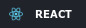

# Hi Everyone 👋 I'm Matias Arias

I'm a Frontend Developer from Argentina who loves **CSS**, **JavaScript**, **React** and **Next.js** I want to create websites that make an impact on people.💜

- ⚡ I'm currently working as a Software Enginner at Santander Tecnología Argentina.
- 🌱 I’m currently learning and studying: **React.js**, **Next.js** and **Firebase**
- 💛 I consider myself a very calm and kind person, I love everything about traveling the world and learning different languages. I speak native Spanish, English (B2).

## 👽 My Portfolio

**Hey, Don´t miss my Portfolio with a lot of cool projects. I had put all my effort and imagination trying to create an amazing portfolio. Hope you like it.**

Deploy: [https://matiasarias.vercel.app/](https://matiasarias.vercel.app/)

## ❤️ Languages and Tools

 

 

 

 

## 🌌 Where to find me

 

---

 

